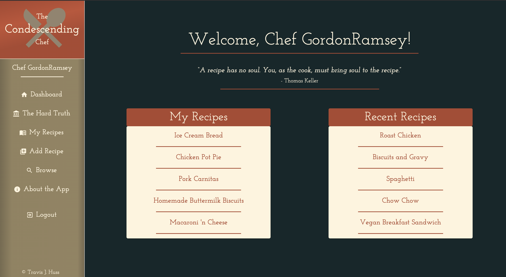
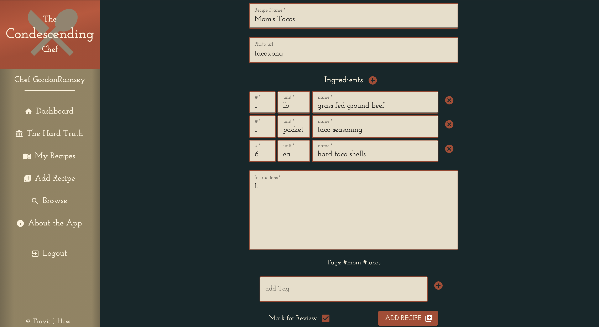
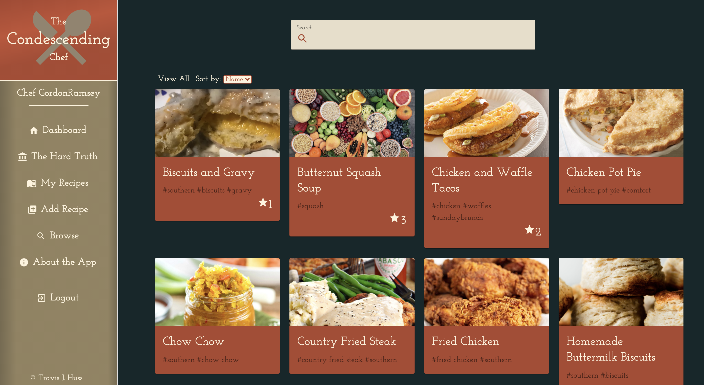
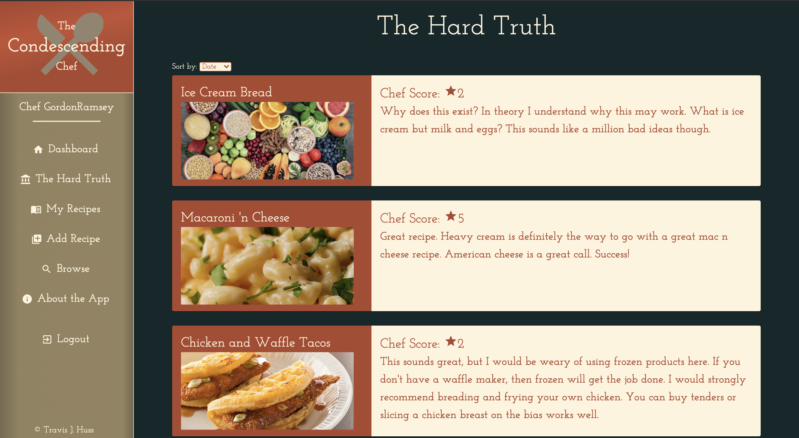

# The Condescending Chef

## Description

_Duration: 2 Week Sprint_

More and more people rely on the internet as a way to get recipes. Many of us just want a simple recipe and end up spending half an hour looking through food blog after food blog only to settle on a recipe that doesn't deliver at the end. A lot of time and energy goes into cooking and having it not work out can be deflating. 

I had the amazing experience of working as a professional chef for 15 years and over time you hone the ability to read a recipe and understand it like some read Shakespeare. I can take one look at a recipe and see where the red flags are. 

Thats where my idea for an app came from. An app built for professional chefs to give feedback to everyday home cooks on recipes they find online, or even their own personal recipes. 

To see the fully functional site, please visit: [DEPLOYED VERSION OF APP](https://shielded-escarpment-88386.herokuapp.com/#/home)

## Screen Shots

### Home Page:

### Add Recipe:

### Browse

### The Hard Truth (reviews)

### Prerequisites

Link to software that is required to install the app (e.g. node).

- [Node.js](https://nodejs.org/en/)
- [PostgreSQL](https://www.postgresql.org/)

## Installation

1. Create a database named `the-condescending-chef`,
2. The queries in the `database.sql` file are set up to create all the necessary tables and populate the needed data to allow the application to run correctly. The project is built on [Postgres](https://www.postgresql.org/download/), so you will need to make sure to have that installed. We recommend using Postico to run those queries as that was used to create the queries, 
3. Open up your editor of choice and run an `npm install`
4. Run `npm run server` in your terminal
5. Run `npm run client` in your terminal
6. The `npm run client` command will open up a new browser tab for you!

## Usage

1. Signup and create a user
2. You can upload a recipe one of two ways. By going to _Add Recipe_ you can fill out a form of your own recipe, or provide a link to upload an outside source recipe. 
3. On either form you have the option to click _Mark For Review_. Doing so will flag that recipe so a chef admin can see it and review it. 
4. While you wait, there you can browse other recipes and read their reviews. 
5. In the future, users will be able to favorite recipes and communicate directly with other users. 
6. That's it. Easy!

## Built With

- React
- Node
- Express
- Material UI
- PostgreSQL
- Redux

## Acknowledgement
Thanks to [Prime Digital Academy](https://www.primeacademy.io) who equipped and helped me to make this application a reality. Thank you to everyone in the Zhu cohort for sharing this experience and pushing each other to grow and be better. 

## Support
If you have suggestions or issues, please email me at [travisjhuss@gmail.com](https://www.gmail.com)